<div align="center">

<a href="https://make1it.pythonanywhere.com"><picture>
<source media="(prefers-color-scheme: dark)" srcset="docs/banner-dark.png">
</picture></a>

<a href="https://make1it.pythonanywhere.com"></a>
<br>
 
 
 <a href="https://wa.me/9647702790915"></a>
 <a href="mailto:engthanoon1@gmail.com"></a>


<p dir="rtl"><b>مهندس تقنيات حاسوب (شبكات واتصالات) من الموصل. أبني من 2019 تطبيقات Flutter وأنظمة Django و Flask، وأربطها بالذكاء الاصطناعي وأجهزة ESP32 والأردوينو. ودرّبت طلاب جامعات، وعندي بحوث منشورة بمجلات عالمية. وهذا المعرض نفسه مؤتمت بالكامل: أداة كتبتها تشغّل كل مشاريعي وتصوّرها وتبني الموقع وترفعه بدون أي تدخل مني.</b></p>

</div>

---


## 👋 About me

<p dir="rtl">مهندس تقنيات حاسوب (شبكات واتصالات) من الموصل. أبني من 2019 تطبيقات Flutter وأنظمة Django و Flask، وأربطها بالذكاء الاصطناعي وأجهزة ESP32 والأردوينو. ودرّبت طلاب جامعات، وعندي بحوث منشورة بمجلات عالمية. وهذا المعرض نفسه مؤتمت بالكامل: أداة كتبتها تشغّل كل مشاريعي وتصوّرها وتبني الموقع وترفعه بدون أي تدخل مني.</p>

<p dir="rtl">📍 الموصل، العراق — متاح للعمل عن بعد أو حضورياً</p>

### 💼 الخبرة · Experience

- **مطوّر Backend و Flutter** · <sub>2019 — الآن</sub><br><sub dir="auto">تطبيقات موبايل متعددة المنصات بـ Flutter، وأنظمة خلفية قابلة للتوسع بـ Django و Flask، ودمج حلول الذكاء الاصطناعي وإدارة المشاريع من البداية للتسليم.</sub>
- **مدرّب ومساعد تقني** · <sub>2021 — الآن</sub><br><sub dir="auto">تدريب طلاب الجامعات على البرمجة وتطوير التطبيقات، والإشراف التقني على مشاريع التخرج، وخدمات البحث العلمي والنشر والمحاكاة للدكاترة والأساتذة.</sub>
- **مطوّر تطبيقات موبايل ودعم فني** · <sub>2022 — 2023</sub><br><sub dir="auto">تطبيقات Flutter مع Firebase، أنظمة الإشعارات وقواعد البيانات اللحظية، ودعم المستخدمين.</sub>
- **مدير سيرفرات** · <sub>2021 — 2023</sub><br><sub dir="auto">إدارة سيرفرات Ubuntu ونشر تطبيقات الويب مع Gunicorn و Redis، والحماية ومراقبة الأداء.</sub>
- **مطوّر تطبيقات ديسكتوب** · <sub>2019 — 2020</sub><br><sub dir="auto">تطبيقات مؤسسات بـ Visual Basic و C/C++، وتدريب الزبائن عليها.</sub>

🎓 **بكالوريوس هندسة تقنيات الحاسوب — شبكات واتصالات · الجامعة التقنية الشمالية (2018 — 2022)**

- بحوث منشورة في مجلات علمية عالمية
- تدريب طلاب جامعات على البرمجة والتقنيات الحديثة
- معسكر Hello Muscat للبرمجة (2023)
- مساهم بفريق MetaLux

<p>               </p>

🗣️ العربية (الأم) · الإنكليزية (ممتازة)

---


## ⭐ Featured


<p align="center">
<a href="https://github.com/Thanoon12k/moalidaty-front-end" title="مولدتي"></a>
<a href="https://github.com/Thanoon12k/moalidaty" title="مولدتي — السيرفر ولوحة الإدارة">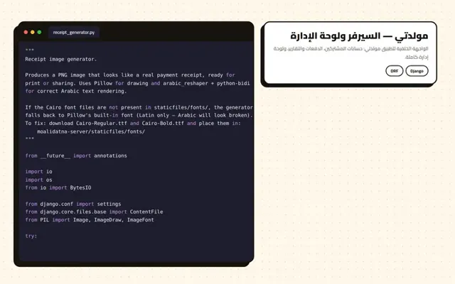</a>
<a href="https://github.com/Thanoon12k/BubbleSheetScanner" title="ببل شيت سكنر">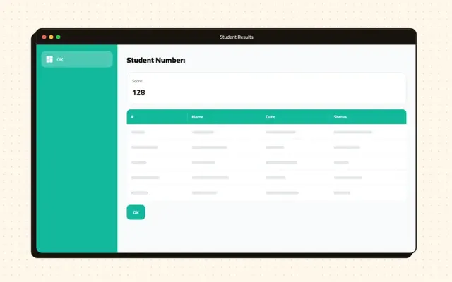</a>
<a href="https://github.com/Thanoon12k/Employee-Manager" title="إدارة موظفين الدائرة"></a>
<a href="https://github.com/Thanoon12k/Pediatric-Clinic-manager" title="عيادتي — إدارة عيادة أطفال">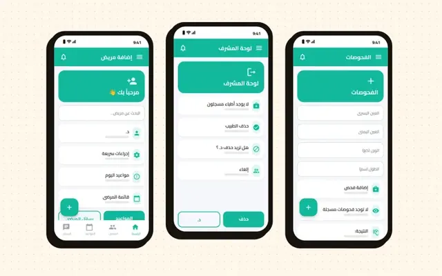</a>
<a href="https://github.com/Thanoon12k/flutter-arduino-based-syringe-pump" title="مضخة الحقنة الطبية الذكية"></a>
</p>


- 📱 **[مولدتي](https://github.com/Thanoon12k/moalidaty-front-end)** <sub>Moalidaty Front End</sub> — `Flutter`
- 🌐 **[مولدتي — السيرفر ولوحة الإدارة](https://github.com/Thanoon12k/moalidaty)** <sub>Moalidaty</sub> — `Django` · `DRF`
- 🖥️ **[ببل شيت سكنر](https://github.com/Thanoon12k/BubbleSheetScanner)** <sub>Bubble Sheet Scanner</sub> — `OpenCV` · `pandas` · `Python desktop` · `Tkinter`
- 📱 **[إدارة موظفين الدائرة](https://github.com/Thanoon12k/Employee-Manager)** <sub>Employee Manager App</sub> — `Flutter`
- 📱 **[عيادتي — إدارة عيادة أطفال](https://github.com/Thanoon12k/Pediatric-Clinic-manager)** <sub>عيادتي – Pediatric Clinic Manager</sub> — `Flutter`
- 🔌 **[مضخة الحقنة الطبية الذكية](https://github.com/Thanoon12k/flutter-arduino-based-syringe-pump)** <sub>مضخة الحقنة الطبية الذكية | Smart Medical Syringe Pump</sub> — `Arduino` · `Flutter`


---

## 📂 All projects


> Tap any picture to open its code. The live site has the full galleries: **[make1it.pythonanywhere.com](https://make1it.pythonanywhere.com)**


<details open>
<summary><h3>🌐 Web — 23</h3></summary>


<p align="center">
<a href="https://github.com/Thanoon12k/moalidaty" title="مولدتي — السيرفر ولوحة الإدارة"></a>
<a href="https://github.com/Thanoon12k/mosul1tourism" title="السياحة في الموصل">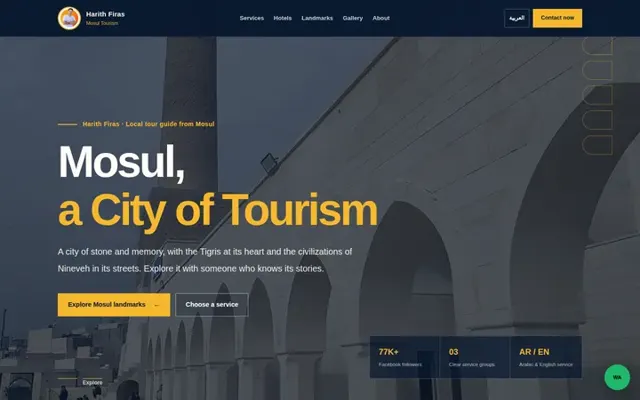</a>
<a href="https://github.com/Thanoon12k/qaser-techani" title="قصر التقني">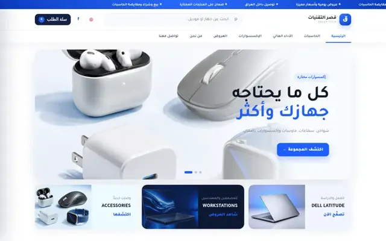</a>
<a href="https://github.com/Thanoon12k/Ideas-Store" title="فِكرة — مخزن الأفكار"></a>
<a href="https://github.com/Thanoon12k/customers-manager" title="نظام إدارة الفواتير والاشتراكات"></a>
<a href="https://github.com/Thanoon12k/Thanoon12k.github.io" title="موقعي الشخصي القديم"></a>
<a href="https://github.com/Thanoon12k/chatgpt-to-word-extension" title="ChatGPT إلى Word — إضافة كروم">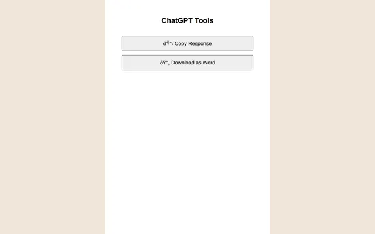</a>
<a href="https://github.com/Thanoon12k/React-Blog" title="React Blog">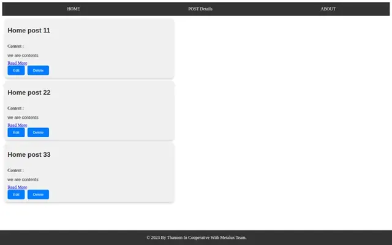</a>
<a href="https://github.com/Thanoon12k/text2mp3_converter" title="تحويل النص إلى MP3">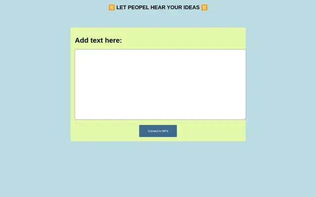</a>
<a href="https://github.com/Thanoon12k/askpdf-backend" title="Askpdf Backend">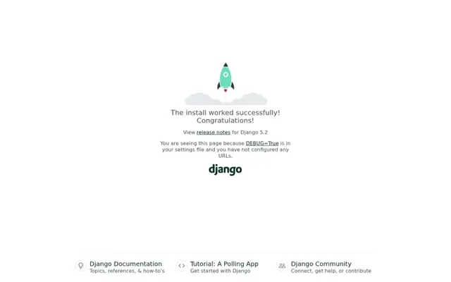</a>
<a href="https://github.com/MetaluxTech/metalux-company" title="Metalux Company">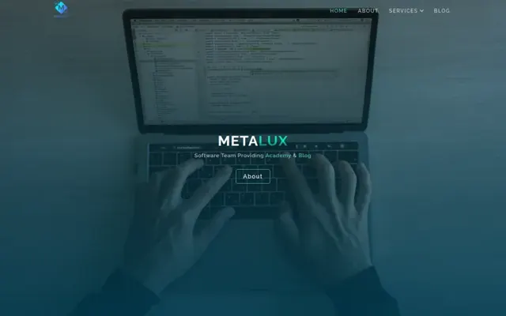</a>
<a href="https://github.com/MetaluxTech/-shortcut-url-react" title="Shortcut Url React"></a>
<a href="https://github.com/MetaluxTech/RestaurantV1Frontend" title="Restaurant V1Frontend">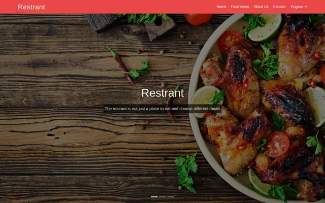</a>
<a href="https://github.com/MetaluxTech/Icream-template" title="Icream-template"></a>
<a href="https://github.com/MetaluxTech/Portfolio" title="Portfolio">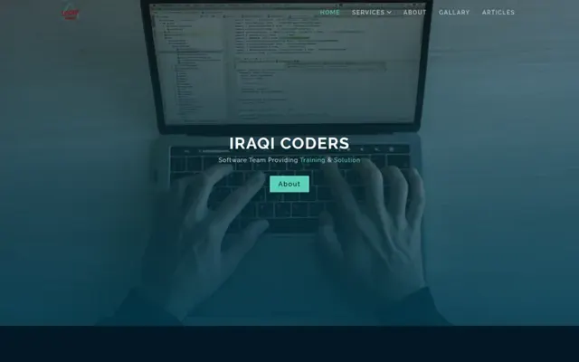</a>
<a href="https://github.com/Thanoon12k/jupyter-lstm-ga" title="Jupyter Lstm Ga">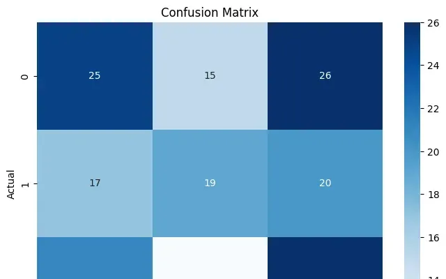</a>
<a href="https://github.com/Thanoon12k/projects-manager" title="مدير المشاريع">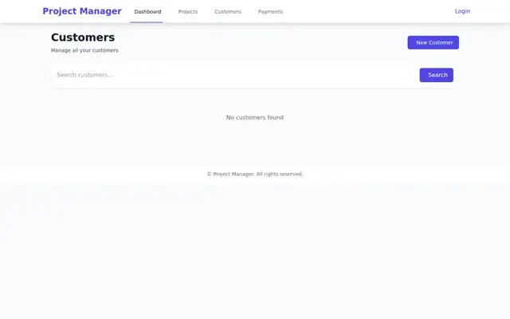</a>
<a href="https://github.com/Thanoon12k/Chat-app-api" title="Chat-app-api"></a>
<a href="https://github.com/Thanoon12k/converter" title="Converter">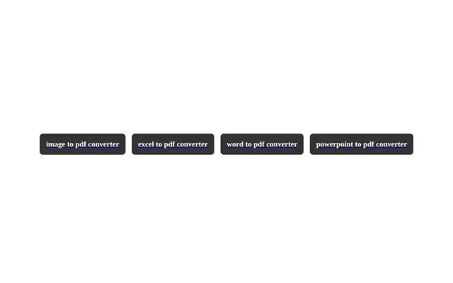</a>
<a href="https://github.com/Thanoon12k/electric" title="Electric">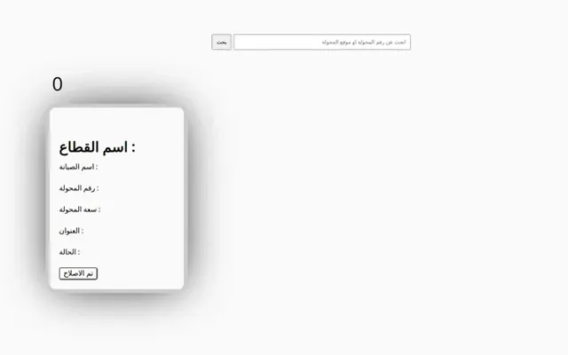</a>
<a href="https://github.com/MetaluxTech/IraqiPad_Mobile" title="IraqPad Mobile App">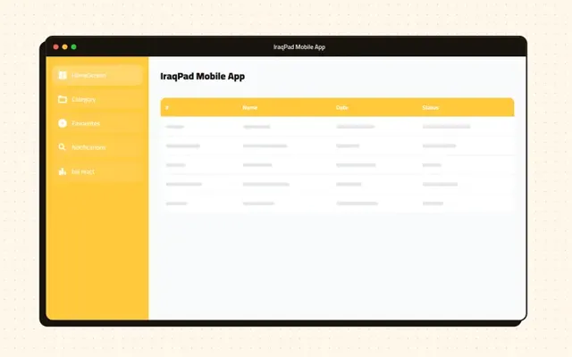</a>
<a href="https://github.com/MetaluxTech/LSTM-GA-API" title="LSTM GA API">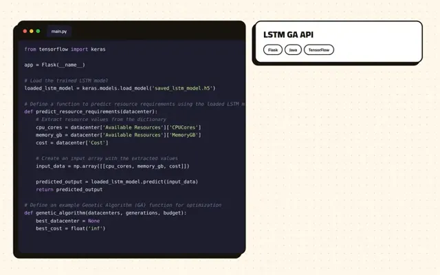</a>
<a href="https://github.com/Thanoon12k/Askme" title="Askme">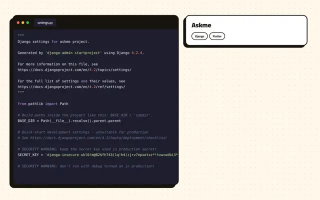</a>
</p>


- **[مولدتي — السيرفر ولوحة الإدارة](https://github.com/Thanoon12k/moalidaty)** <sub>Moalidaty</sub> — `Django` · `DRF`<br><sub dir="auto">الواجهة الخلفية لتطبيق مولدتي: حسابات المشتركين، الدفعات والتقارير، ولوحة إدارة كاملة.</sub>
- **[السياحة في الموصل](https://github.com/Thanoon12k/mosul1tourism)** <sub>حارث فراس — السياحة في الموصل</sub> — `Flask`<br><sub dir="auto">موقع ثنائي اللغة (العربية والإنكليزية) مبني بـ Flask، ويضم:</sub>
- **[قصر التقني](https://github.com/Thanoon12k/qaser-techani)** <sub>Qaser Techani</sub> — `Flask` · `HTML/CSS` · `react` · `tailwindcss`
- **[فِكرة — مخزن الأفكار](https://github.com/Thanoon12k/Ideas-Store)** <sub>فِكْرة (Fikra) — Ideas Store</sub> — `Django` · `DRF`<br><sub dir="auto">A minimalist Django web application for capturing and organizing future ideas with voice notes, images, and rich descriptions.</sub>
- **[نظام إدارة الفواتير والاشتراكات](https://github.com/Thanoon12k/customers-manager)** <sub>نظام إدارة الفواتير</sub> — `Django`<br><sub dir="auto">نظام شامل لإدارة الفواتير والاشتراكات بالدينار العراقي باستخدام Django و Tailwind CSS.</sub>
- **[موقعي الشخصي القديم](https://github.com/Thanoon12k/Thanoon12k.github.io)** <sub>Thanoon12k.github.io</sub> — `HTML/CSS`
- **[ChatGPT إلى Word — إضافة كروم](https://github.com/Thanoon12k/chatgpt-to-word-extension)** <sub>Chatgpt To Word Extension</sub> — `Browser extension` · `JavaScript`
- **[React Blog](https://github.com/Thanoon12k/React-Blog)** — `React`
- **[تحويل النص إلى MP3](https://github.com/Thanoon12k/text2mp3_converter)** <sub>Text To MP3 Converter 🎶</sub> — `Django` · `DRF`<br><sub dir="auto">An online tool for effortlessly converting text to MP3. Designed for precision and user-friendliness, users can instantly upload their…</sub>
- **[Askpdf Backend](https://github.com/Thanoon12k/askpdf-backend)** — `Django`
- **[Metalux Company](https://github.com/MetaluxTech/metalux-company)** — `HTML/CSS`
- **[Shortcut Url React](https://github.com/MetaluxTech/-shortcut-url-react)** — `React`
- **[Restaurant V1Frontend](https://github.com/MetaluxTech/RestaurantV1Frontend)** — `HTML/CSS`
- **[Icream-template](https://github.com/MetaluxTech/Icream-template)** — `HTML/CSS`
- **[Portfolio](https://github.com/MetaluxTech/Portfolio)** — `HTML/CSS`
- **[Jupyter Lstm Ga](https://github.com/Thanoon12k/jupyter-lstm-ga)** — `Flask` · `Jupyter` · `matplotlib` · `pandas`
- **[مدير المشاريع](https://github.com/Thanoon12k/projects-manager)** <sub>Project Manager</sub> — `Django` · `DRF`<br><sub dir="auto">A comprehensive Django-based project management system with Google Sheets integration and WhatsApp messaging capabilities.</sub>
- **[Chat-app-api](https://github.com/Thanoon12k/Chat-app-api)** — `Django` · `DRF` · `Selenium` · `WebSockets`
- **[Converter](https://github.com/Thanoon12k/converter)** — `Django` · `React`
- **[Electric](https://github.com/Thanoon12k/electric)** — `Django`
- **[IraqPad Mobile App](https://github.com/MetaluxTech/IraqiPad_Mobile)** — `JavaScript` · `Node.js` · `react`<br><sub dir="auto">IraqPad Mobile App is a project that connects with a WordPress website, enabling users to read and post Articles/Novels. The app…</sub>
- **[LSTM GA API](https://github.com/MetaluxTech/LSTM-GA-API)** — `Flask` · `Java` · `TensorFlow`
- **[Askme](https://github.com/Thanoon12k/Askme)** — `Django` · `Flutter`

</details>


<details open>
<summary><h3>📱 Mobile — 7</h3></summary>


<p align="center">
<a href="https://github.com/Thanoon12k/moalidaty-front-end" title="مولدتي"></a>
<a href="https://github.com/Thanoon12k/Employee-Manager" title="إدارة موظفين الدائرة"></a>
<a href="https://github.com/Thanoon12k/Pediatric-Clinic-manager" title="عيادتي — إدارة عيادة أطفال"></a>
<a href="https://github.com/Thanoon12k/medicine-reminder" title="تذكير الدواء">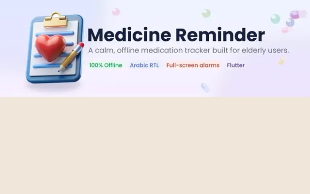</a>
<a href="https://github.com/Thanoon12k/Chat-App-Flutter" title="Chat App Flutter">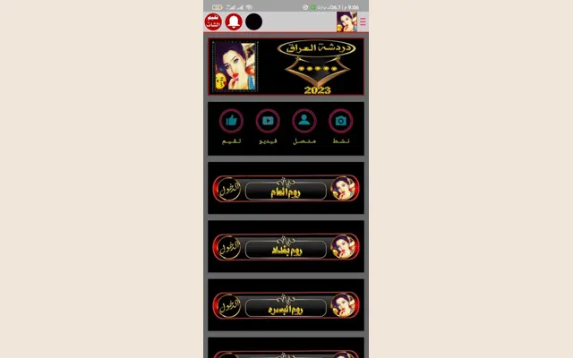</a>
<a href="https://github.com/Thanoon12k/hand-moving-sensor" title="Hand Moving Sensor">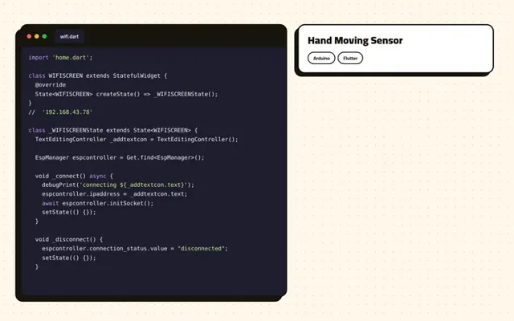</a>
<a href="https://github.com/Thanoon12k/Speak-Loud" title="Speak Loud">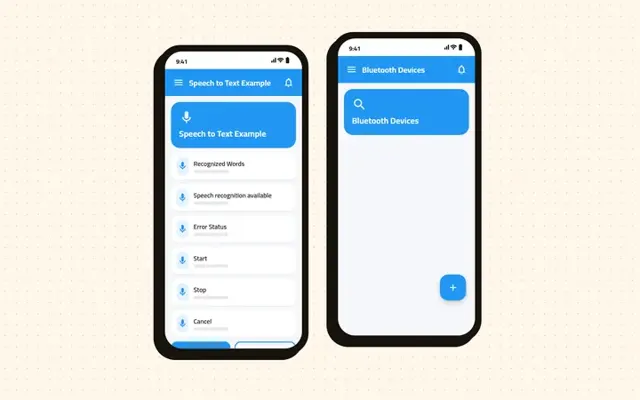</a>
</p>


- **[مولدتي](https://github.com/Thanoon12k/moalidaty-front-end)** <sub>Moalidaty Front End</sub> — `Flutter`<br><sub dir="auto">نظام متكامل لإدارة المولدات الأهلية: المشتركين والأمبيرات، الدفعات، الرواتب وكادر التشغيل، والأرباح والخسائر. البيانات تُخزن على سيرفر…</sub>
- **[إدارة موظفين الدائرة](https://github.com/Thanoon12k/Employee-Manager)** <sub>Employee Manager App</sub> — `Flutter`<br><sub dir="auto">نظام شؤون موظفين بصلاحيات متعددة (مدير / موظف): إرسال الاستبيانات والكتب الرسمية بصيغة PDF أو صور، الرد عليها، عرض النتائج، ولوحة مراقبة…</sub>
- **[عيادتي — إدارة عيادة أطفال](https://github.com/Thanoon12k/Pediatric-Clinic-manager)** <sub>عيادتي – Pediatric Clinic Manager</sub> — `Flutter`<br><sub dir="auto">نظام كامل لعيادة الأطفال: صلاحيات (مدير / طبيب / مريض)، ملفات المرضى، المواعيد، الوصفات، اللقاحات ومخططات النمو، محادثة لحظية، وتقارير…</sub>
- **[تذكير الدواء](https://github.com/Thanoon12k/medicine-reminder)** <sub>💊 What it does</sub> — `Flutter`<br><sub dir="auto">تطبيق تذكير بالدواء لكبار السن: عربي بالكامل، خط كبير، يشتغل بدون إنترنت نهائياً، وما يطلب حساب ولا أي معلومة شخصية.</sub>
- **[Chat App Flutter](https://github.com/Thanoon12k/Chat-App-Flutter)** — `Flutter`
- **[Hand Moving Sensor](https://github.com/Thanoon12k/hand-moving-sensor)** — `Arduino` · `Flutter`
- **[Speak Loud](https://github.com/Thanoon12k/Speak-Loud)** — `Flutter`

</details>


<details>
<summary><h3>🖥️ Desktop — 7</h3></summary>


<p align="center">
<a href="https://github.com/Thanoon12k/BubbleSheetScanner" title="ببل شيت سكنر"></a>
<a href="https://github.com/MetaluxTech/Image-resizing" title="Image Resizing">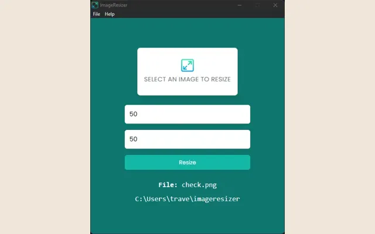</a>
<a href="https://github.com/Thanoon12k/Injaz" title="إنجاز — مدير المهام">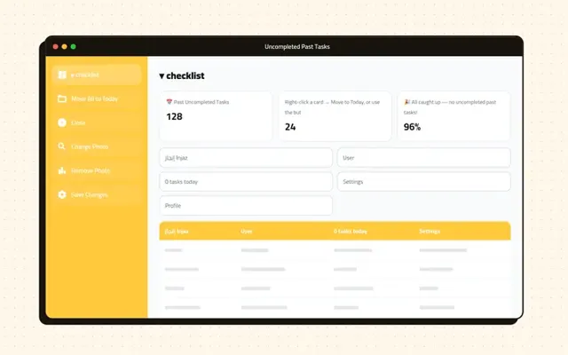</a>
<a href="https://github.com/Thanoon12k/thesis-sources-notes" title="مدير مصادر الرسالة">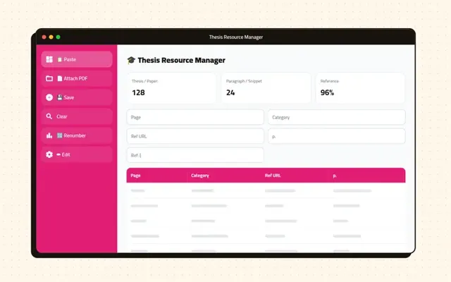</a>
<a href="https://github.com/Thanoon12k/excel_dynamic_date" title="Excel Dynamic Date">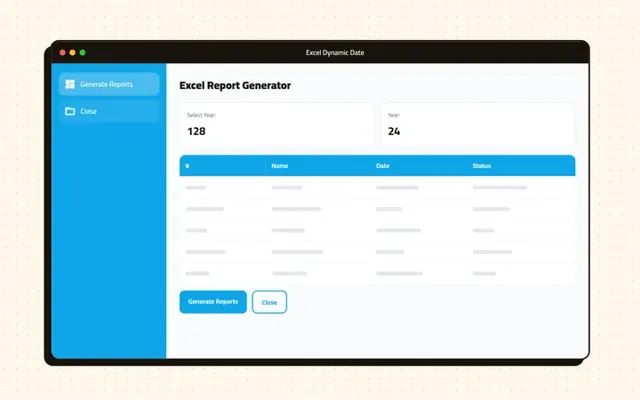</a>
<a href="https://github.com/Thanoon12k/EmployeesPromotionApp" title="Employees Promotion App">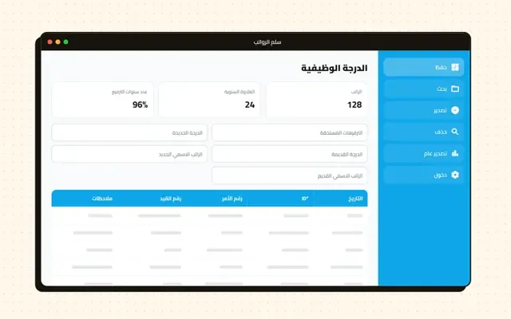</a>
<a href="https://github.com/MetaluxTech/airline-management-app" title="airline-management-app">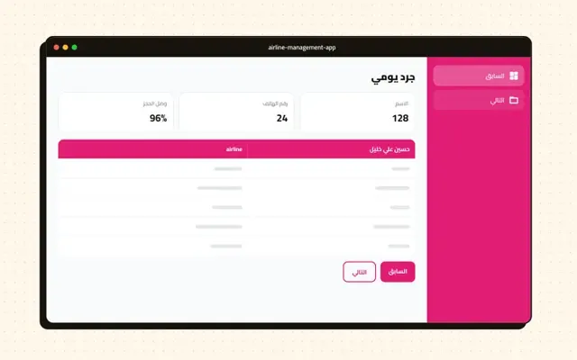</a>
</p>


- **[ببل شيت سكنر](https://github.com/Thanoon12k/BubbleSheetScanner)** <sub>Bubble Sheet Scanner</sub> — `OpenCV` · `pandas` · `Python desktop` · `Tkinter`<br><sub dir="auto">يقرأ أوراق الأجوبة (Bubble Sheet) للجامعات والمدارس بدقة عالية: اسم الطالب، إجاباته، ودرجته — ويصدّرها لملف إكسل جاهز. يشتغل بالكامل…</sub>
- **[Image Resizing](https://github.com/MetaluxTech/Image-resizing)** — `electron` · `JavaScript`
- **[إنجاز — مدير المهام](https://github.com/Thanoon12k/Injaz)** <sub>إنجاز — Injaz</sub> — `PyQt` · `Python desktop` · `SQLite`<br><sub dir="auto">A beautiful offline Python desktop task manager with daily task tracking, checklists, priorities, tags, and a teal animated UI.</sub>
- **[مدير مصادر الرسالة](https://github.com/Thanoon12k/thesis-sources-notes)** <sub>Thesis Resource Manager</sub> — `CustomTkinter` · `Python desktop` · `SQLite` · `Tkinter`<br><sub dir="auto">A modern desktop application to organize, categorize, and manage resources (paragraphs, references, media) for engineering theses with…</sub>
- **[Excel Dynamic Date](https://github.com/Thanoon12k/excel_dynamic_date)** — `Excel` · `Python desktop`<br><sub dir="auto">This project provides a dynamic date feature for Excel spreadsheets. It allows users to automatically update dates based on specific…</sub>
- **[Employees Promotion App](https://github.com/Thanoon12k/EmployeesPromotionApp)** — `.NET`
- **[airline-management-app](https://github.com/MetaluxTech/airline-management-app)** — `electron` · `JavaScript` · `react` · `vite`<br><sub dir="auto">An Electron application with React</sub>

</details>


<details open>
<summary><h3>🔌 Hardware & IoT — 6</h3></summary>


<p align="center">
<a href="https://github.com/Thanoon12k/flutter-arduino-based-syringe-pump" title="مضخة الحقنة الطبية الذكية"></a>
<a href="https://github.com/Thanoon12k/Fingerprints-Attendance-System" title="نظام الحضور بالبصمة">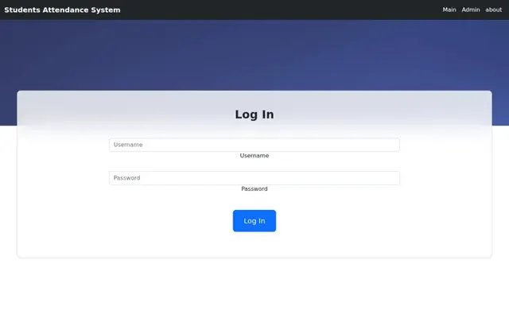</a>
<a href="https://github.com/Thanoon12k/ESP_TEMP_SENSOR" title="لوحة حساس الحرارة ESP"></a>
<a href="https://github.com/Thanoon12k/ZKTeco-ZKFinger-PRINTS-SCANNER" title="ربط قارئ بصمة ZKTeco">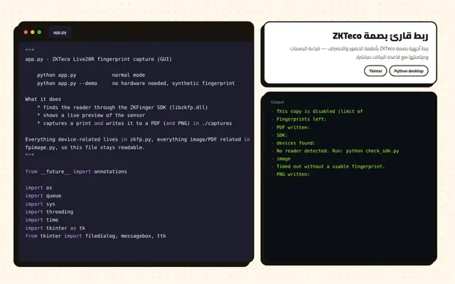</a>
<a href="https://github.com/Thanoon12k/IOT-Temperature-Sensor" title="مراقب حرارة المفقسة">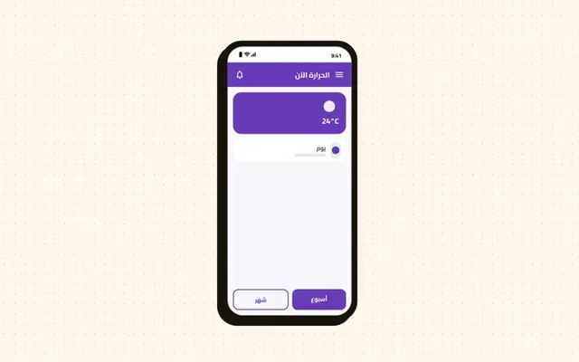</a>
<a href="https://github.com/Thanoon12k/Arduino-As-OscilloScope" title="Arduino As Oscillo Scope"></a>
</p>


- **[مضخة الحقنة الطبية الذكية](https://github.com/Thanoon12k/flutter-arduino-based-syringe-pump)** <sub>مضخة الحقنة الطبية الذكية | Smart Medical Syringe Pump</sub> — `Arduino` · `Flutter`<br><sub dir="auto">تطبيق يتحكم بمضخة حقنة طبية عبر الأردوينو: إدارة الجرعات، تحذيرات سلامة قبل الحقن، ومراقبة لحظية مع رسم ثلاثي الأبعاد للمحقنة.</sub>
- **[نظام الحضور بالبصمة](https://github.com/Thanoon12k/Fingerprints-Attendance-System)** <sub>Fingerprints Attendance System</sub> — `CustomTkinter` · `Django` · `OpenCV` · `pandas`
- **[لوحة حساس الحرارة ESP](https://github.com/Thanoon12k/ESP_TEMP_SENSOR)** <sub>Temperature Display Dashboard</sub> — `Arduino` · `Flask` · `REST`<br><sub dir="auto">لوحة ويب تعرض قراءات حساس الحرارة المربوط بـ ESP بشكل لحظي.</sub>
- **[ربط قارئ بصمة ZKTeco](https://github.com/Thanoon12k/ZKTeco-ZKFinger-PRINTS-SCANNER)** <sub>ZKTeco Live20R — Fingerprint to PDF</sub> — `Python desktop` · `Tkinter`<br><sub dir="auto">ربط أجهزة بصمة ZKTeco بأنظمة الحضور والانصراف — قراءة البصمات ومزامنتها مع قاعدة البيانات مباشرة.</sub>
- **[مراقب حرارة المفقسة](https://github.com/Thanoon12k/IOT-Temperature-Sensor)** <sub>IOT Temperature Sensor</sub> — `Flutter`<br><sub dir="auto">قراءة لحظية ومستمرة لدرجة الحرارة داخل المفقسة، مع مخططات بيانية بالساعة أو الأسبوع أو الشهر أو خلال فترة تحددها أنت.</sub>
- **[Arduino As Oscillo Scope](https://github.com/Thanoon12k/Arduino-As-OscilloScope)** — `Arduino`

</details>


<details>
<summary><h3>🤖 AI — 7</h3></summary>


<p align="center">
<a href="https://github.com/Thanoon12k/green-chrome-notes" title="ملاحظات ذكية — إضافة كروم">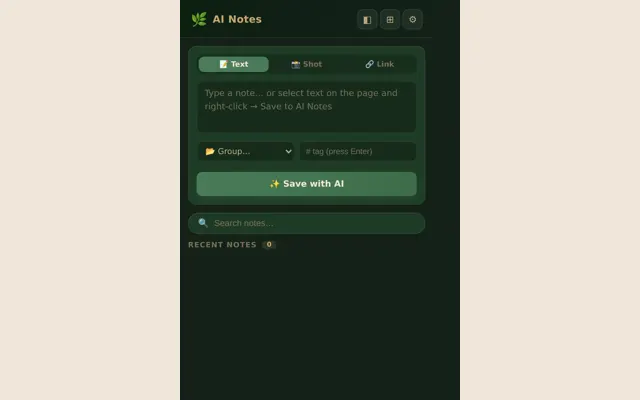</a>
<a href="https://github.com/Thanoon12k/Arabic-Text-To-Audio-Converter" title="تحويل النص العربي إلى صوت">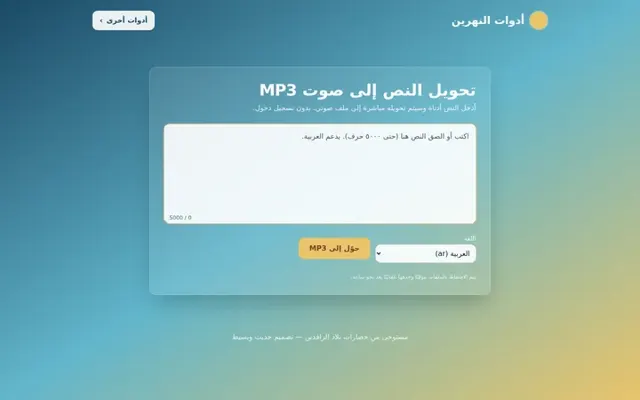</a>
<a href="https://github.com/Thanoon12k/Social-Media-Automation" title="مدير صفحات السوشيال ميديا"></a>
<a href="https://github.com/Thanoon12k/Youtube-Translator" title="مترجم يوتيوب اللحظي"></a>
<a href="https://github.com/MetaluxTech/Cloud-Simulation-AI" title="AI Cloud Simulation Platform">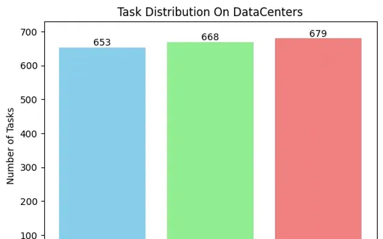</a>
<a href="https://github.com/Thanoon12k/background_remover" title="إزالة خلفية الصور">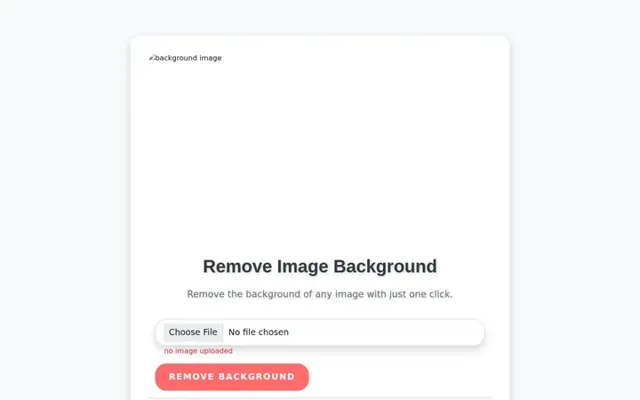</a>
<a href="https://github.com/Thanoon12k/AI-Arabic-handwriting-OCR" title="التعرف على خط اليد العربي">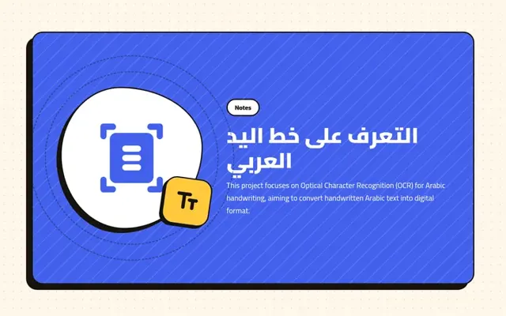</a>
</p>


- **[ملاحظات ذكية — إضافة كروم](https://github.com/Thanoon12k/green-chrome-notes)** <sub>🌿 AI Notes — Smart Tab Capture</sub> — `Browser extension`<br><sub dir="auto">&gt; A premium Chrome extension powered by Groq AI to capture, organize, and tag notes from any browser tab.</sub>
- **[تحويل النص العربي إلى صوت](https://github.com/Thanoon12k/Arabic-Text-To-Audio-Converter)** <sub>Arabic Text‑To‑Audio Converter (Flask + Tailwind)</sub> — `Excel` · `Flask` · `video`<br><sub dir="auto">Arabic Text‑To‑Audio Converter is a modern, login‑free web app that converts Arabic (and English) text into high‑quality MP3 audio. It’s…</sub>
- **[مدير صفحات السوشيال ميديا](https://github.com/Thanoon12k/Social-Media-Automation)** <sub>Social Media Automation</sub> — `Django`<br><sub dir="auto">ينشر ويجدول المنشورات على صفحات التواصل من داخل السيرفر، ويدعم الربط بوكيل ذكاء اصطناعي يدير المحتوى والردود.</sub>
- **[مترجم يوتيوب اللحظي](https://github.com/Thanoon12k/Youtube-Translator)** <sub>Python YouTube Real-Time Translator</sub> — `Django` · `video`<br><sub dir="auto">A revolutionary Chrome extension and web tool designed to transform your YouTube experience with real-time voice translations. Built…</sub>
- **[AI Cloud Simulation Platform](https://github.com/MetaluxTech/Cloud-Simulation-AI)** — `Java` · `Jupyter` · `matplotlib` · `pandas`<br><sub dir="auto">This project is an AI Simulation Platform that comprises three main components: ga-lstm, AIcode, and simulationcode. Each component…</sub>
- **[إزالة خلفية الصور](https://github.com/Thanoon12k/background_remover)** <sub>Image Background Remover Website 🖼️</sub> — `Django` · `DRF` · `REST`<br><sub dir="auto">An online tool for effortlessly removing image backgrounds. Designed for precision and user-friendliness, users can instantly upload and…</sub>
- **[التعرف على خط اليد العربي](https://github.com/Thanoon12k/AI-Arabic-handwriting-OCR)** <sub>Arabic Handwriting OCR</sub> — `Notes`<br><sub dir="auto">This project focuses on Optical Character Recognition (OCR) for Arabic handwriting, aiming to convert handwritten Arabic text into…</sub>

</details>


<details>
<summary><h3>🛰️ Networks & Simulation — 3</h3></summary>


<p align="center">
<a href="https://github.com/Thanoon12k/AI-cloud-network-manager" title="AI Cloud Network Manager">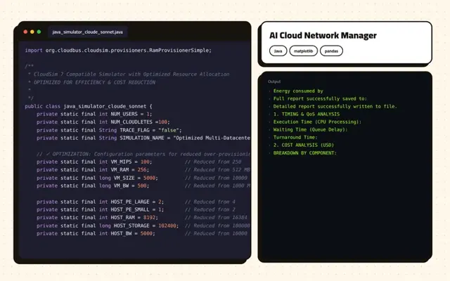</a>
<a href="https://github.com/Thanoon12k/cloud-network-simulator" title="Cloud Network Simulator">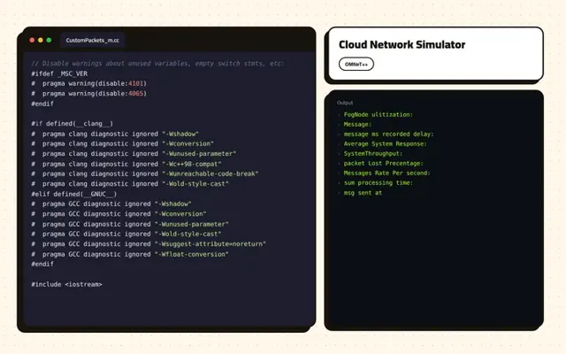</a>
<a href="https://github.com/MetaluxTech/FogSimulation" title="Fog Simulation: Initial Version">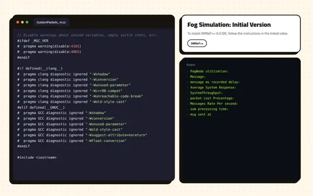</a>
</p>


- **[AI Cloud Network Manager](https://github.com/Thanoon12k/AI-cloud-network-manager)** — `Java` · `matplotlib` · `pandas`
- **[Cloud Network Simulator](https://github.com/Thanoon12k/cloud-network-simulator)** — `OMNeT++`
- **[Fog Simulation: Initial Version](https://github.com/MetaluxTech/FogSimulation)** — `OMNeT++`<br><sub dir="auto">To install OMNeT++ 6.0 IDE, follow the instructions in the linked video:</sub>

</details>


<details>
<summary><h3>🧰 Tools — 8</h3></summary>


<p align="center">
<a href="https://github.com/Thanoon12k/ROUTER-AQM-FIFO-CODEL-PIE-comparison" title="Network Queue Management Simulation">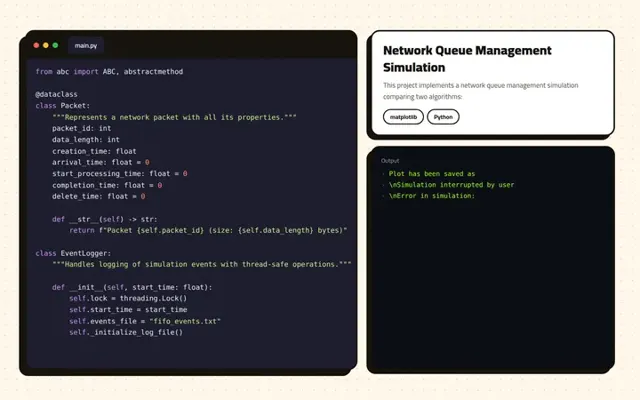</a>
<a href="https://github.com/Thanoon12k/Video-Audio-Studio" title="Video-Audio Studio">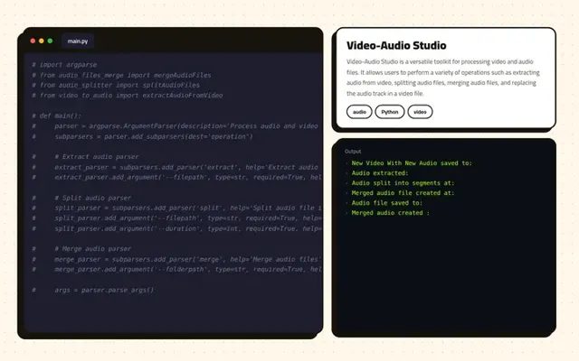</a>
<a href="https://github.com/Thanoon12k/pdf-words-counter" title="Pdf Words Counter">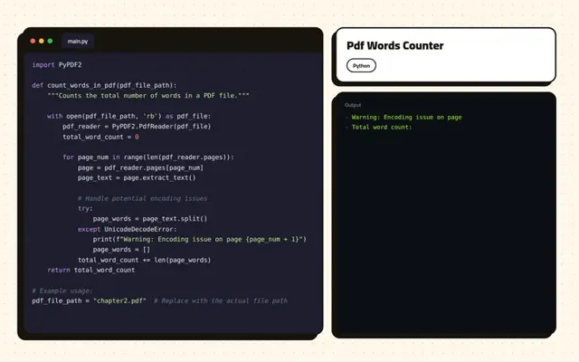</a>
<a href="https://github.com/MetaluxTech/CatFactsExample" title="Cat Facts Example">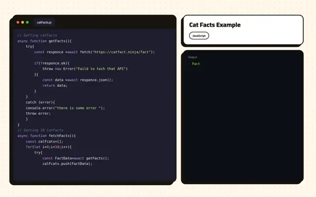</a>
<a href="https://github.com/Thanoon12k/Tik-Tok-Pass-captcha" title="Tik Tok Pass Captcha">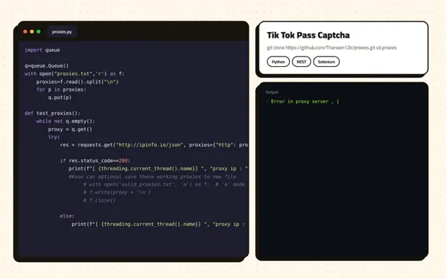</a>
<a href="https://github.com/Thanoon12k/desktopBackgroundChange" title="Desktop Background Change">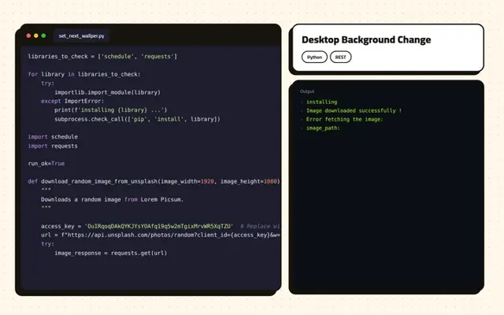</a>
<a href="https://github.com/Thanoon12k/chess-analyser" title="Chess Analyser">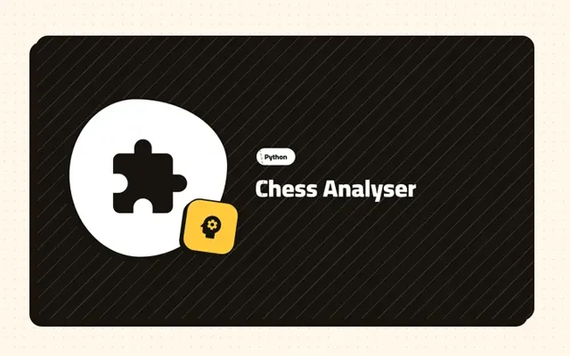</a>
<a href="https://github.com/Thanoon12k/MRFO-Optimizer" title="MRFO Optimizer">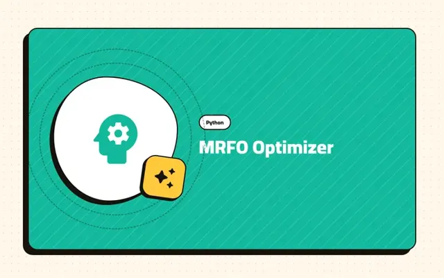</a>
</p>


- **[Network Queue Management Simulation](https://github.com/Thanoon12k/ROUTER-AQM-FIFO-CODEL-PIE-comparison)** — `matplotlib` · `Python`<br><sub dir="auto">This project implements a network queue management simulation comparing two algorithms:</sub>
- **[Video-Audio Studio](https://github.com/Thanoon12k/Video-Audio-Studio)** — `audio` · `Python` · `video`<br><sub dir="auto">Video-Audio Studio is a versatile toolkit for processing video and audio files. It allows users to perform a variety of operations such…</sub>
- **[Pdf Words Counter](https://github.com/Thanoon12k/pdf-words-counter)** — `Python`
- **[Cat Facts Example](https://github.com/MetaluxTech/CatFactsExample)** — `JavaScript`
- **[Tik Tok Pass Captcha](https://github.com/Thanoon12k/Tik-Tok-Pass-captcha)** — `Python` · `REST` · `Selenium`<br><sub dir="auto">git clone https://github.com/Thanoon12k/proxies.git cd proxies</sub>
- **[Desktop Background Change](https://github.com/Thanoon12k/desktopBackgroundChange)** — `Python` · `REST`
- **[Chess Analyser](https://github.com/Thanoon12k/chess-analyser)** — `Python`
- **[MRFO Optimizer](https://github.com/Thanoon12k/MRFO-Optimizer)** — `Python`

</details>


<details>
<summary><h3>📚 Research & Notes — 2</h3></summary>


<p align="center">
<a href="https://github.com/Thanoon12k/AI-agents-basics" title="AI Agents Basics">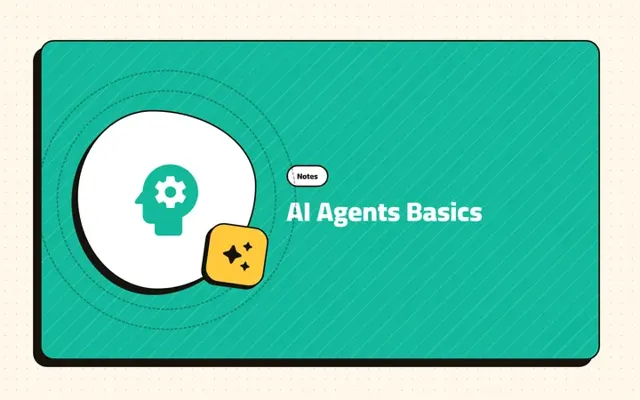</a>
<a href="https://github.com/Thanoon12k/NextJs-Share-Prompts" title="Prompet Share">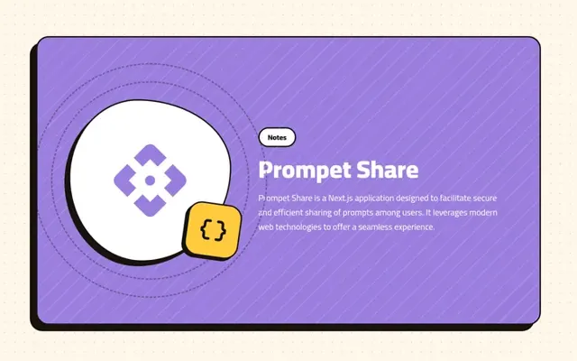</a>
</p>


- **[AI Agents Basics](https://github.com/Thanoon12k/AI-agents-basics)** — `Notes`
- **[Prompet Share](https://github.com/Thanoon12k/NextJs-Share-Prompts)** — `Notes`<br><sub dir="auto">Prompet Share is a Next.js application designed to facilitate secure and efficient sharing of prompts among users. It leverages modern…</sub>

</details>


---

## 🖼️ The site


<p align="center">
<a href="https://make1it.pythonanywhere.com">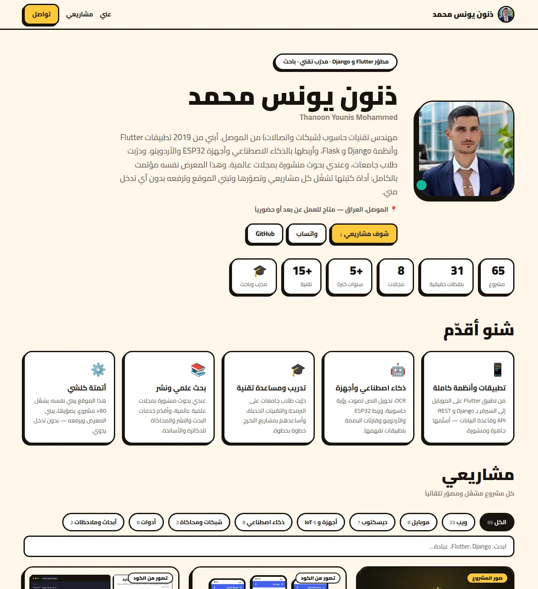</a>
<a href="https://make1it.pythonanywhere.com">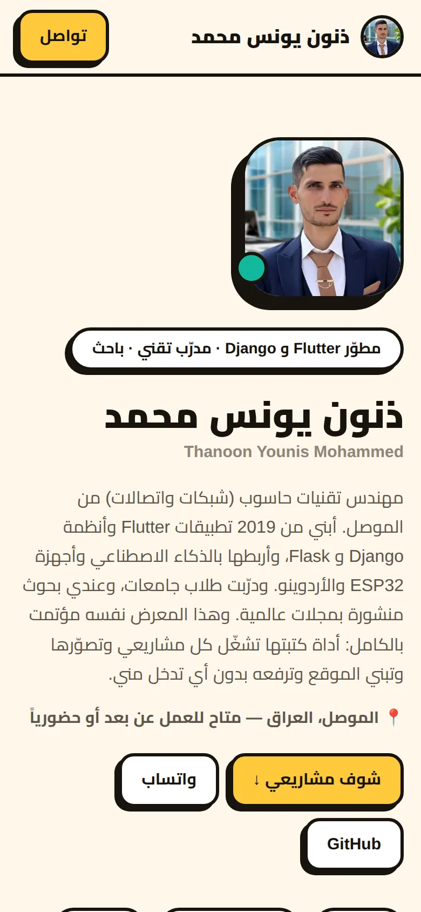</a>
</p>


**Picture labels** — every image on the site says what it is:

- **Live screenshot** (لقطة حقيقية)
- **Rendered templates** (من قوالب المشروع)
- **Repo images** (صور المشروع)
- **Mock-up from source** (تصور من الكود)
- **Cover art** (غلاف)


---

## ⚙️ How it is made — `showcase/`

A Python tool that turns a list of GitHub repos into this portfolio:

```text
clone ─► shoot ─► build ─► deploy        (+ readme → this file)
```

| Step | What happens |
|---|---|
| **clone** | Pulls every repo in `showcase/config.json` |
| **shoot** | Detects each project type and **runs it** — Django (migrates, creates a demo user and logs in), Flask, FastAPI, Streamlit, React/Vite/Next, static sites, Chrome extensions — then crawls it with headless Chromium for desktop + mobile screenshots |
| ↳ fallback | Renders the app's own HTML templates → pulls README / notebook images → draws a mock-up **from the source code** (Flutter `Text()` strings, icons and colours; Tkinter/Qt/WinForms labels; Arduino `Serial` output) → generated cover art |
| **build** | Static site: RTL Arabic, filters, search, galleries, favicon, dark mode |
| **deploy** | Uploads to PythonAnywhere, sets WSGI + static mappings, reloads |
| **admin** | `/admin` on the live site: upload screenshots to any project, create new projects, edit or hide — saved outside the deploy folder so redeploys never wipe it |

```bash
pip install playwright pillow jinja2 flask
python -m playwright install chromium

export PA_TOKEN=...            # PythonAnywhere API token — never commit it
python -m showcase all          # clone + shoot + build + deploy
python -m showcase shoot Injaz  # redo one project
python -m showcase readme --dest .   # regenerate this README
```

Details (Arabic): [`showcase/README.md`](showcase/README.md)

